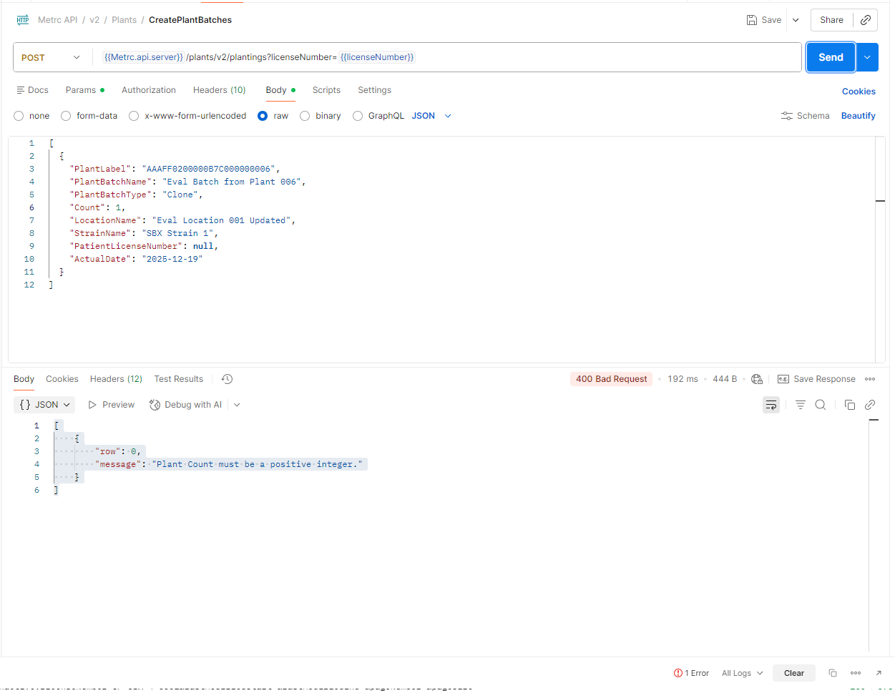

# Metrc API Proficiency Evaluation Guide

## Overview

This guide will help you complete the Metrc API Proficiency Evaluation using the Python client we built. The evaluation requires you to demonstrate proficiency in using the Metrc API by performing specific tasks and documenting the results.

## Important Notes

- **All operations return 200 OK** if successful
- **Use Metrc Sandbox environment** for testing
- **Only modify data you create** - don't delete existing data
- **Minify JSON** responses before pasting into cells
- **Record all verification items**: ID numbers, names, tags, dates, request URLs, JSON

## Company Information Section

Fill out these fields in **CompanyInformation.csv**:

```
Integrator Company Name: [Your Company Name]
Company Web Site: [Your website]
Company Telephone Number: [Phone]
Company Email Contact: [Email]
Company Address: [Address]
Company City and State: [City, State]
Company Zip Code: [Zip]
Primary Contact Name: [Name]
Primary Contact Email: [Email]
Primary Contact Telephone Number: [Phone]
Secondary Contact Name: [Optional]
Secondary Contact Email: [Optional]
Secondary Contact Telephone Number: [Optional]
Name of Vendor Software: [Your Software Name]
Vendor Key Used: [Your Software API Key - first 10 chars only]
User Key Used: [Sandbox User API Key - first 10 chars only]
```

## Permissions Section

Based on your requirements (Cultivation + Processing), check these in **Permissions.csv**:

### For Cultivation License:
- ✅ Locations (POST/PUT/DELETE)
- ✅ Strains (POST/PUT/DELETE)
- ✅ Plant Batches / Plants (POST/PUT/DELETE)
- ✅ Harvests (POST/PUT/DELETE)
- ✅ Items (POST/PUT/DELETE)
- ✅ Packages (POST/PUT/DELETE)
- ✅ GET Transfers / Wholesale
- ✅ Transfer Template / External Incoming (Optional)

### For Processing License:
- ✅ Strains (POST/PUT/DELETE)
- ✅ Items (POST/PUT/DELETE)
- ✅ Packages (POST/PUT/DELETE)
- ✅ GET Transfers / Wholesale
- ✅ Transfer Template / External Incoming (Optional)

## States Section

Mark **MA (Massachusetts)** with YES for:
- Plant Batches: YES
- Open Loop States: YES
- Vegetative: YES
- Mother Plants: YES
- Flowering: YES
- Harvests: YES
- Packages: YES
- Labs: YES
- Sales: YES
- Sales Deliveries: YES
- Get Wholesale & Transfers: YES
- Transfer Templates: YES

## Completing the Technical Tasks

### Setup Script for All Tasks

Create this file: `C:\python\metrc_api\evaluation_tasks.py`

```python
"""
Script to complete Metrc API Proficiency Evaluation tasks.
Run each section separately and record results.
"""
from config import MetrcConfig
from client import MetrcClient
from cultivation import CultivationClient
from processing import ProcessingClient
from utils import DateUtils
from datetime import datetime
import json

# Initialize clients
config = MetrcConfig.from_env()
client = MetrcClient(config)
cultivation = CultivationClient(client)
processing = ProcessingClient(client)

# Helper to minify JSON
def minify_json(data):
    return json.dumps(data, separators=(',', ':'))

# Helper to print result
def print_result(step, response, request_url, request_body=None):
    print(f"\n{'='*60}")
    print(f"STEP: {step}")
    print(f"{'='*60}")
    print(f"Result Code: 200")
    print(f"Request URL: {request_url}")
    if request_body:
        print(f"Request Body (minified):")
        print(minify_json(request_body))
    if response:
        print(f"Response (minified):")
        print(minify_json(response) if isinstance(response, (dict, list)) else response)
    print(f"Last Modified: {DateUtils.now_iso()}")
    print(f"{'='*60}\n")

# Store your license number
LICENSE_NUMBER = "YOUR_SANDBOX_LICENSE_HERE"  # e.g., "CML17-0000001"
```

---

## Task-by-Task Instructions

### 1. LOCATIONS

```python
# STEP 1: Create Location
location_data = [{
    "Name": "Eval Location 001",
    "LocationTypeName": "Default"
}]

result = processing.create_locations(location_data, LICENSE_NUMBER)
print_result("Location Step 1", result, 
    f"POST {config.base_url}/locations/v2/create?licenseNumber={LICENSE_NUMBER}",
    location_data)

# Get the created location to find ID
locations = processing.get_locations(LICENSE_NUMBER)
created_location = [l for l in locations if l['Name'] == 'Eval Location 001'][0]
location_id = created_location['Id']
print(f"Created Location ID: {location_id}")

# STEP 2: Update Location Name
update_data = [{
    "Id": location_id,
    "Name": "Eval Location 001 Updated",
    "LocationTypeName": "Default"
}]

result = processing.update_locations(update_data, LICENSE_NUMBER)
print_result("Location Step 2", result,
    f"PUT {config.base_url}/locations/v2/update?licenseNumber={LICENSE_NUMBER}",
    update_data)

# STEP 3: GET specific location
locations = processing.get_locations(LICENSE_NUMBER)
updated_location = [l for l in locations if l['Id'] == location_id][0]
print_result("Location Step 3", updated_location,
    f"GET {config.base_url}/locations/v2/{location_id}?licenseNumber={LICENSE_NUMBER}")
```

**Record in Locations.csv:**
- Result code: 200
- License Facility: [Your license]
- ID Number: [location_id]
- Location Name Created: "Eval Location 001 Updated"
- Request Sent: [URLs from output]
- JSON Body: [Minified JSON from output]

---

### 2. STRAINS

```python
# STEP 1: Create Strain
strain_data = [{
    "Name": "Eval Strain 001",
    "TestingStatus": "None",
    "ThcLevel": 0.18,
    "CbdLevel": 0.02,
    "IndicaPercentage": 50.0,
    "SativaPercentage": 50.0
}]

result = cultivation.create_strains(strain_data, LICENSE_NUMBER)
print_result("Strain Step 1", result,
    f"POST {config.base_url}/strains/v2/create?licenseNumber={LICENSE_NUMBER}",
    strain_data)

# Get created strain ID
strains = cultivation.get_strains(LICENSE_NUMBER)
created_strain = [s for s in strains if s['Name'] == 'Eval Strain 001'][0]
strain_id = created_strain['Id']
print(f"Created Strain ID: {strain_id}")

# STEP 2: Update Strain
update_data = [{
    "Id": strain_id,
    "Name": "Eval Strain 001",
    "TestingStatus": "None",
    "ThcLevel": 0.20,
    "CbdLevel": 0.03,
    "IndicaPercentage": 60.0,
    "SativaPercentage": 40.0
}]

result = cultivation.update_strains(update_data, LICENSE_NUMBER)
print_result("Strain Step 2", result,
    f"PUT {config.base_url}/strains/v2/update?licenseNumber={LICENSE_NUMBER}",
    update_data)

# STEP 3: GET specific strain
strains = cultivation.get_strains(LICENSE_NUMBER)
updated_strain = [s for s in strains if s['Id'] == strain_id][0]
print_result("Strain Step 3", updated_strain,
    f"GET {config.base_url}/strains/v2/{strain_id}?licenseNumber={LICENSE_NUMBER}")
```

**Record in Strains.csv**

---

### 3. ITEMS

```python
# STEP 1: Create Item
item_data = [{
    "ItemCategory": "Buds",
    "Name": "Eval Item 001",
    "UnitOfMeasure": "Grams",
    "Strain": "Eval Strain 001",
    "UnitThcPercent": 18.5,
    "UnitCbdPercent": 2.0
}]

result = processing.create_items(item_data, LICENSE_NUMBER)
print_result("Item Step 1", result,
    f"POST {config.base_url}/items/v2/create?licenseNumber={LICENSE_NUMBER}",
    item_data)

# Get created item ID
items = processing.get_items(LICENSE_NUMBER)
created_item = [i for i in items if i['Name'] == 'Eval Item 001'][0]
item_id = created_item['Id']
print(f"Created Item ID: {item_id}")

# STEP 2: Update Item (change unit of measure)
update_data = [{
    "Id": item_id,
    "ItemCategory": "Buds",
    "Name": "Eval Item 001",
    "UnitOfMeasure": "Ounces",  # Changed from Grams
    "Strain": "Eval Strain 001",
    "UnitThcPercent": 18.5,
    "UnitCbdPercent": 2.0
}]

result = processing.update_items(update_data, LICENSE_NUMBER)
print_result("Item Step 2", result,
    f"PUT {config.base_url}/items/v2/update?licenseNumber={LICENSE_NUMBER}",
    update_data)

# STEP 3: GET specific item
items = processing.get_items(LICENSE_NUMBER)
updated_item = [i for i in items if i['Id'] == item_id][0]
print_result("Item Step 3", updated_item,
    f"GET {config.base_url}/items/v2/{item_id}?licenseNumber={LICENSE_NUMBER}")
```

**Record in Items.csv**

---

### 4. PLANT BATCHES

```python
# STEP 1: Create Plant Batch with 6 plants
batch_data = [{
    "Name": "Eval Batch 001",
    "Type": "Seed",
    "Count": 6,
    "Strain": "Eval Strain 001",
    "Location": "Eval Location 001 Updated",  # Use created location
    "Item": "Eval Item 001",  # Use created item
    "PatientLicenseNumber": None,
    "ActualDate": DateUtils.date_only(datetime.now())
}]

result = cultivation.create_plant_batches_from_packages(batch_data, LICENSE_NUMBER)
print_result("Plant Batch Step 1", result,
    f"POST {config.base_url}/plantbatches/v2/createplantings?licenseNumber={LICENSE_NUMBER}",
    batch_data)

# Get batch ID
batches = cultivation.get_plant_batches('active', license_number=LICENSE_NUMBER)
created_batch = [b for b in batches if b['Name'] == 'Eval Batch 001'][0]
batch_id = created_batch['Id']
print(f"Created Batch ID: {batch_id}")

# STEP 2: Create package of 3 clones from batch
# NOTE: You need available tags from the sandbox
package_data = [{
    "PlantBatch": "Eval Batch 001",
    "Count": 3,
    "Location": "Eval Location 001 Updated",
    "Item": "Eval Item 001",
    "Tag": "GET_TAG_FROM_AVAILABLE",  # Get from GET /packages/v2/types
    "PatientLicenseNumber": None,
    "ActualDate": DateUtils.date_only(datetime.now())
}]

# Get available tags first
# tags = client.get("packages/v2/available", license_number=LICENSE_NUMBER)
# Use one of the available tags

result = cultivation.create_plant_batches_from_mother(package_data, LICENSE_NUMBER)
print_result("Plant Batch Step 2", result,
    f"POST {config.base_url}/plantbatches/v2/create/packages?licenseNumber={LICENSE_NUMBER}",
    package_data)

# STEP 3: Change growth phase of 2 plants to Vegetative
# You'll need starting tags
change_data = [{
    "Name": "Eval Batch 001",
    "Count": 2,
    "StartingTag": "GET_FIRST_TAG",  # From available tags
    "GrowthPhase": "Vegetative",
    "NewLocation": "Eval Location 001 Updated",
    "GrowthDate": DateUtils.date_only(datetime.now()),
    "PatientLicenseNumber": None
}]

result = cultivation.change_plant_batch_growth_phase(change_data, LICENSE_NUMBER)
print_result("Plant Batch Step 3", result,
    f"POST {config.base_url}/plantbatches/v2/changegrowthphase?licenseNumber={LICENSE_NUMBER}",
    change_data)

# STEP 4: Destroy 1 plant
destroy_data = [{
    "PlantBatch": "Eval Batch 001",
    "Count": 1,
    "ReasonNote": "Evaluation test",
    "ActualDate": DateUtils.date_only(datetime.now())
}]

result = cultivation.destroy_plant_batches(destroy_data, LICENSE_NUMBER)
print_result("Plant Batch Step 4", result,
    f"DELETE {config.base_url}/plantbatches/v2?licenseNumber={LICENSE_NUMBER}",
    destroy_data)
```

**Record in PlantBatches.csv**

---

### 5. PLANTS

You'll need to work with actual flowering plants in the sandbox. The evaluation assumes you have access to existing plants.

```python
# STEP 1: Move flowering plant to different location
# First, get a flowering plant
flowering_plants = cultivation.get_plants('flowering', license_number=LICENSE_NUMBER)
test_plant = flowering_plants[0]  # Pick one

move_data = [{
    "Id": test_plant['Id'],
    "Label": test_plant['Label'],
    "Location": "Eval Location 001 Updated",
    "ActualDate": DateUtils.date_only(datetime.now())
}]

result = cultivation.move_plants(move_data, LICENSE_NUMBER)
print_result("Plant Step 1", result,
    f"PUT {config.base_url}/plants/v2/moveplants?licenseNumber={LICENSE_NUMBER}",
    move_data)

# Continue with remaining plant steps...
# Steps 2-6 follow similar patterns
```

**Record in Plants.csv**

---

### 6. HARVESTS

```python
# STEP 1: Create package from harvest
# (Assuming you created a harvest in Plant Step 6)

package_data = [{
    "Tag": "GET_AVAILABLE_TAG",
    "Location": "Eval Location 001 Updated",
    "Item": "Eval Item 001",
    "UnitOfWeight": "Grams",
    "PatientLicenseNumber": None,
    "Note": "Evaluation package",
    "IsProductionBatch": False,
    "IsTradeSample": False,
    "IsTestingSample": False,
    "ProductRequiresRemediation": False,
    "ActualDate": DateUtils.date_only(datetime.now()),
    "Ingredients": [{
        "HarvestName": "YOUR_HARVEST_NAME",
        "Weight": 100.0,
        "UnitOfWeight": "Grams"
    }]
}]

result = cultivation.create_harvest_packages(package_data, LICENSE_NUMBER)
print_result("Harvest Step 1", result,
    f"POST {config.base_url}/harvests/v2/create/packages?licenseNumber={LICENSE_NUMBER}",
    package_data)

# Steps 2-4 continue similarly...
```

**Record in Harvest.csv**

---

### 7. PACKAGES

```python
# STEP 1: Create package from another package
new_package_data = [{
    "Tag": "GET_AVAILABLE_TAG",
    "Location": "Eval Location 001 Updated",
    "Item": "Eval Item 001",
    "Quantity": 10.0,
    "UnitOfMeasure": "Grams",
    "ActualDate": DateUtils.date_only(datetime.now()),
    "Ingredients": [{
        "Package": "SOURCE_PACKAGE_TAG",
        "Quantity": 10.0,
        "UnitOfMeasure": "Grams"
    }]
}]

result = processing.create_packages(new_package_data, LICENSE_NUMBER)
print_result("Package Step 1", result,
    f"POST {config.base_url}/packages/v2/create?licenseNumber={LICENSE_NUMBER}",
    new_package_data)

# Continue with steps 2-5...
```

**Record in Packages.csv**

---

## Tips for Success

1. **Run GET /facilities/v2 first** to see your permissions
2. **Get available tags** before creating packages/plants
3. **Use the data you created** (strains, items, locations) in subsequent steps
4. **Minify JSON** using online tool or Python: `json.dumps(data, separators=(',', ':'))`
5. **Save output** after each step
6. **Take screenshots** of successful 200 responses
7. **Keep a log** of all IDs, names, tags created

## Final Submission Checklist

- [ ] Company Information completed
- [ ] Permissions section marked correctly for MA
- [ ] All technical tasks show 200 result codes
- [ ] All verification items filled (IDs, names, tags, dates)
- [ ] All JSON bodies minified and recorded
- [ ] All request URLs documented
- [ ] No data deleted that wasn't created by you
- [ ] All responses are verifiable in sandbox

## Common Issues

- **Tags not available**: Request more from Metrc support
- **Permission denied**: Check API user key has admin permissions
- **Strain/Item not found**: Ensure you're using exact names (case-insensitive)
- **Date format errors**: Use ISO 8601 format from DateUtils

Good luck with your evaluation!
